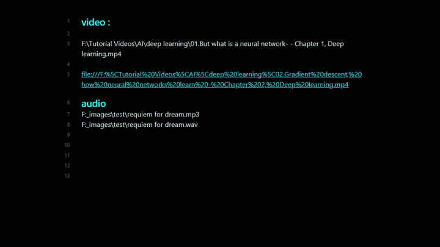

# Local Media Embedder Plugin

The Local Media Embedder plugin for Obsidian allows you to easily embed local media files (images, videos, audio) into your notes. This plugin enhances your note-taking experience by enabling seamless integration of multimedia content.

## Features

- Embed local images, videos, and audio files directly into your notes.
- Supports various media formats (e.g., JPG, PNG, MP4, MP3).
- Simple and intuitive interface for embedding media.
- Lightweight and efficient, ensuring smooth performance.

## Installation

The  plugin is not yet available in the Obsidian Community Plugins gallery. You can install the plugin manually by following these steps:
### manual installation

1. Download the plugin from github released.
2. Extract the contents of the zip file to your Obsidian plugins  directory: `E:/..../yourVault/.obsidian/plugins/`.
3. Enable the plugin in Obsidian by navigating to `Settings` > `Community plugins` > `Installed plugins` and toggling the Local Media Embedder plugin.

### Using BRAT :

Add the current  to BRAT Plugin it will automatically download and install the plugin for you 


## Usage :

Now you can use code block to embed media files instead of using tags
```markdown
 ```media
path: F:\Tutorial Videos\AI\deep learning\01.But what is a neural network- - Chapter 1, Deep learning.mp4
type: video
width: 640
height: 360

```



## Acknowledgements

Special thanks to the Obsidian Devs & community 
