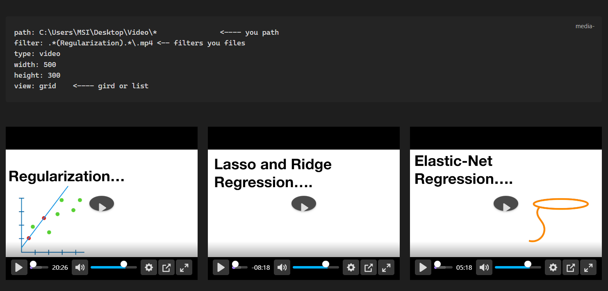
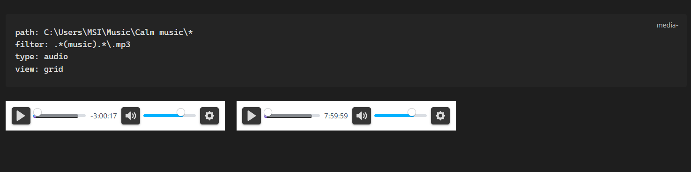

# Local Media Embedder Plugin
    


The Local Media Embedder plugin for Obsidian allows you to easily embed local media files (videos, audio) into your notes. This plugin enhances your note-taking experience by enabling seamless integration of multimedia content.

## Features

- Embed local videos, and audio files directly into your notes.
- Supports various media formats (e.g., MP4, MP3).
- Simple and intuitive interface for embedding media.
- Lightweight and efficient, ensuring smooth performance.

## Change Log
### 0.1.4
- **multiple videos**: Supports embedding multiple videos in a note as grid or list .
- **multiple audios**: Supports embedding multiple audios in a note.
- **picture-in-picture**: Supports picture-in-picture mode for videos.
### 0.1.3
- **External Files Access**: Allows using files located outside the vault, with no need to copy them into the vault.
- **Enhanced Player**: Integrated Better Video Player for a superior media experience.
- **YouTube Support**: Supports playing YouTube videos directly.
- **Note Timestamps**: Support adding timestamps to your notes when clicking seek in the video (for better video-synchronized notes).


## Installation

The plugin is available in the Obsidian Community Plugins gallery. You can install it directly within Obsidian.

## Usage :

- **Easy Embedding**: Select a file path in your note, right-click, and choose **"Embed selected media path"** to automatically generate the media code block.
- **Interactive Timestamps**: While a video is playing, right-click the player and select **"Add timestamp"**. This inserts a timestamp into your note that, when clicked, will automatically seek the video to that exact moment.

### Example Code Block:

### One video /audio 
````markdown
 ```media
path: F:\Tutorial Videos\AI\deep learning\01.But what is a neural network- - Chapter 1, Deep learning.mp4
type: video
width: 640
height: 360
```
````

### Multiple Videos / audios
````markdown
```media
path: C:\Users\username\Music\* <---- you path (ends with *)
filter: .*(music).*\.mp3 <-- filters you files
type: audio
view: grid
```
````

````markdown
```media
path: C:\Users\Username\Desktop\Video\*               <---- you path 
filter: .*(Keyword).*\.mp4 <-- filters you files
type: video
width: 500
height: 300
view: grid    <---- gird or list 
```
````







## Acknowledgements

Special thanks to the Obsidian devs and the community ⭐ 
